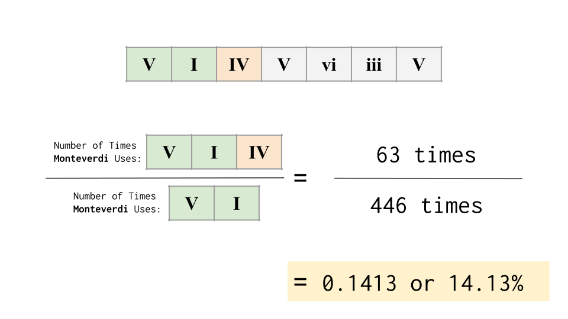
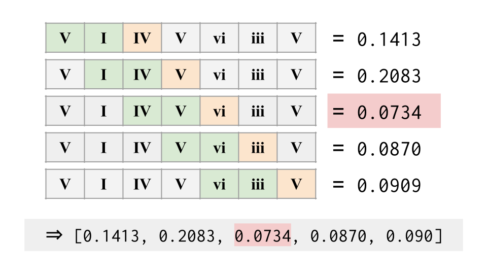

# Music 21 Conventional Progressions

Tommy Heng and Miguel Vega's final project for MIT's Computational Music Theory class (21M.383) taught by Prof. Michael Cuthbert.

The idea of this project is to allow the user to be able to submit a chord progression. The algorithm will then in some way analyze how closely this chord progression resembles the music patterns of a particular composer.

# Table of Contents

* Format Roman Numeral Datasets
* Conducting Frequency Analysis
  * [Method 1 - Whole Progression Frequency](#method-1)
  * [Method 2 - Probability Given All Preceding Chords](#method-2)
  * [Method 3 - Probability Given Some Preceding Chords](#method-3)

# Format Roman Numeral Datasets

The first Jupyter Notebook of interest is `List Generator.ipynb`. In this notebook, the goal is to format songs from several known composers into a text file which can be easily parsed and analyzed by the next python notebook.

In the end, the format that we chose to encode the songs into is to separate each song with new line characters `\n`. Within each song, the data for each chord is separated by commas.

# Conducting Frequency Analysis

The second Jupyter Notebook of interest is `Chord Progression Frequency Analysis.ipynb`, where we actually conduct the frequency analysis.

This notebook contains a handful of helper functions and methods.

## Method 1 - Whole Progression Frequency

The first method we implemented would look at the entire chord progression the user would provide and count the number of occurrences of the full progression occurs in the specified composer's repertoire.

To interpret this as a preference, we count the total number of `n`-long chords in the composer's repertoire, where `n` is the number of chords in the user's chord progression. Then, we count the number of times that the user's provided chord progression occurs in the composer's repertoire. Finally, we divide the latter by the former to get a fraction we interpret as the preference of the user's full chord progression to others of the same length.

### Problems

First, this approach cannot tell us which part of the chord progression was the least like work made by the composer. At worst, it simply tells the user whether it even appears in the composer's repertoire at all.

Second, the choice to divide the number of occurrences by the number of chords of the same length is arbitrary. For a large enough data-set, this would simply be dividing the number of occurrences by the number of chords in the composers repertoire, and thus the score does not is not of much substance.

Finally, the key issue with the first option is that if the length of the user's repertoire is too long, or if it doesn't appear in the composer's repertoire, then it is considered impossible.

## Method 2 - Probability Given Preceding Chords 

To address the first issue with Method 1 where the analysis method does not tell the user which part of the chord progression contributes to being more or less similar to the given composer, we will use a method that interprets frequencies we gather when counting as probabilities. We will be returning a list of numbers, which tells us how often the composer follows a given sequence of chords by the next chord. In otherwords, what is the probability of the first `i` chords being followed by the `ith` chord.

Below is an example illustrating the probability that the progression `[V,I]` is followed by the chord `[IV]`.

Additionally, this method fixes starting position of the context to the beginning of the user's provided chord progression. Below illustrates this process and the list that is returned by method 2.

### Problems

This shares the issue of length with Method 1, where longer chord progressions will get less and less likely. However, because this approach returns a list of frequencies rather than one, we can determine a more meaningful number than a flat frequency of 0.

Because of the fixed start position for the context, long enough chord progressions will reach 0 and remain 0 for the rest of the progression. There should be some degree of translation invariance

## Method 3 - Probability Given Some Preceding Chords

The final method that we implemented was a sliding kernel. Rather than fixing the context's start position and varying the length of the context being used, we will fix the length of the context and vary the starting position of the calculation. This approach resembles a 1-dimensional kernel being applied to the user's chord progression. Below is an illustration that shows this process.

This sliding kernel is also a step towards addressing the problem of translational invariance. The likelihood that the composer follows VI with a IV does not largely vary based on all of the chords which precede.

Finally, to draw conclusions using the data from this method, we find the minimum output of the kernel. If the this value is below some arbirtrary threshold, we highlight this portion of the progression and suggest that the user reconsider this portion of their chord progression to increase similarity with the composer.

In the final application, we set the arbitrary threshold to `5%` or `0.05`. Thus, the final application would rate that this progression as somewhat similar to Monteverdi's repertoire.

### Problems

The main problem with this method is the assumption that frequencies in the repertoire will closely reflect the probability that the given composer will follow some phrase with the next chord.

Additionally, it would be worth taking into account the location of the chord in the overall song. This way, we can account for the timing of chord progressions.

# Future Work

* Currently, this project only works using the `rntxt` files that come natively with the music21 library: 46 songs by Monteverdi and 20 by Bach. Ideally, we would have many more datasets for each composer, and more composers to choose from.

* We would want to encode duration as well into the datasets, incorporating the relative length of the chord in some way to contribute to the comparison.

* Highlight locations in the progression which are not conventional for the given composer to use.

* Based on the kernel approach, we could try to use a recurrent neural network to take into account the position of the chord in the song, assuming the user's chord progression starts at the beginning of the piece we are analyzing.
